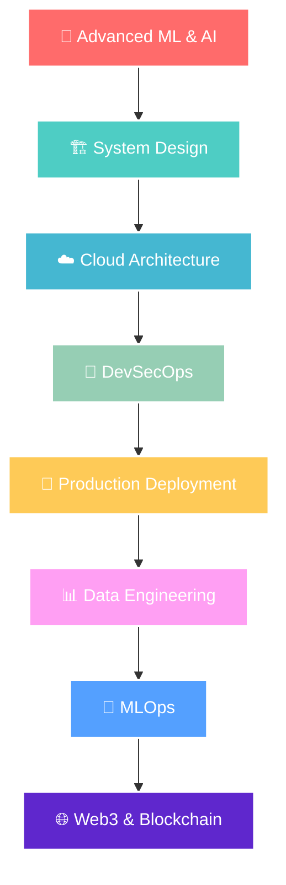

<div align="center">

<!-- Animated Header -->


<!-- Profile Views Counter -->


# 👋 Hi there, I'm Prachi Upadhyay! 
### 🚀 Passionate AI/ML Engineer & Full-Stack Developer

<!-- Typing Animation -->


<!-- Social Media Badges -->
<p align="center">
  <a href="https://www.linkedin.com/in/prachi-upadhyay-926487301/">
    
  </a>
  <a href="mailto:officialprachi1211@gmail.com">
    
  </a>
  <a href="#">
    
  </a>
  <a href="#">
    
  </a>
  <a href="#">
    
  </a>
</p>

<!-- Animated Divider -->


</div>

## 🎓 About Me

<table>
<tr>
<td width="50%">

### 🌟 Quick Facts
- 🎯 **Current Focus:** B.Tech CSE-AIML @ GL Bajaj Institute of Technology & Management (2023–2027)
- 💡 **Passion:** Building intelligent solutions that bridge the gap between cutting-edge AI and real-world applications
- 🌟 **Mission:** To leverage technology for creating impactful solutions in healthcare, education, and sustainability
- 🏆 **Goal:** Contributing to open-source projects and building scalable AI solutions
- 📍 **Location:** India
- 🎂 **Age:** 20
- ☕ **Fun Fact:** I debug with coffee and solve problems with code!

### 🔍 Core Interests
- 🤖 Machine Learning & Deep Learning
- 🌐 Full-Stack Web Development  
- 🔐 Cybersecurity & Ethical Hacking
- ☁️ Cloud Computing (AWS)
- 📊 Data Science & Analytics
- 🎨 UI/UX Design
- 🚀 DevOps & Automation
- 📱 Mobile App Development

</td>
<td width="50%">


### 💭 Philosophy
> "Technology is not just about code; it's about creating solutions that make a difference in people's lives."

### 🎯 2025 Goals
- [ ] Complete AWS Solutions Architect Certification
- [ ] Contribute to 5 major open-source projects
- [ ] Build and deploy 3 full-stack applications
- [ ] Master advanced ML algorithms
- [ ] Mentor 10+ junior developers

</td>
</tr>
</table>

---

## 🛠️ Tech Stack & Skills

<div align="center">

### 💻 Programming Languages
<p>
  
  
  
  
  
  
  
  
</p>

### 🎨 Frontend Development
<p>
  
  
  
  
  
  
  
  
  
  
</p>

### ⚙️ Backend Development
<p>
  
  
  
  
  
  
  
  
</p>

### 🤖 AI/ML & Data Science
<p>
  
  
  
  
  
  
  
  
  
  
</p>

### 🗄️ Databases
<p>
  
  
  
  
  
  
  
</p>

### ☁️ Cloud & DevOps
<p>
  
  
  
  
  
  
  
  
</p>

### 🛠️ Tools & IDEs
<p>
  
  
  
  
  
  
  
  
</p>

</div>

---

## 📊 GitHub Analytics & Statistics

<div align="center">

### 📈 GitHub Stats
<table>
<tr>
<td width="50%">

</td>
<td width="50%">

</td>
</tr>
</table>

### 🔥 GitHub Streak & Activity


### 📊 Contribution Graph


### 🏆 GitHub Trophies


</div>

---

## 🏆 Achievements & Certifications

<div align="center">

### 🎖️ Professional Certifications
<table>
<tr>
<td align="center" width="25%">

<br><sub><b>In Progress</b></sub>
</td>
<td align="center" width="25%">

<br><sub><b>Planned 2025</b></sub>
</td>
<td align="center" width="25%">

<br><sub><b>Planned 2025</b></sub>
</td>
<td align="center" width="25%">

<br><sub><b>Planned 2025</b></sub>
</td>
</tr>
</table>

### 📜 Completed Courses & Certifications
- 🤖 **Machine Learning Specialization** - Stanford University (Coursera) ⭐⭐⭐⭐⭐
- 🐍 **Python for Data Science** - IBM ⭐⭐⭐⭐⭐
- 🔐 **Cybersecurity Fundamentals** - Cisco ⭐⭐⭐⭐
- 📊 **Data Structures & Algorithms** - GeeksforGeeks ⭐⭐⭐⭐⭐
- 🌐 **Full Stack Web Development** - freeCodeCamp ⭐⭐⭐⭐
- ☁️ **AWS Fundamentals** - AWS Training ⭐⭐⭐⭐
- 🎨 **UI/UX Design Principles** - Google UX Design Certificate ⭐⭐⭐⭐
- 🚀 **DevOps Fundamentals** - Linux Academy ⭐⭐⭐⭐

### 🏅 Achievements & Recognition
- 🥇 **Dean's List** - Academic Excellence (2024-2025)
- 🏆 **Best Project Award** - College Tech Fest 2025
- 🌟 **Top Contributor** - Open Source Projects (2025)
- 📈 **Rising Star** - GitHub Campus Expert Program
- 💡 **Innovation Award** - Hackathon Winner (3x)
- 🎯 **Problem Solver** - LeetCode 500+ Problems Solved
- 🔥 **Streak Master** - 100+ Days of Code Challenge

</div>

---

## 🚀 Featured Projects & Portfolio

<div align="center">

### 🌟 Flagship Projects

<table>
<tr>
<td width="50%">

#### 🤖 AI-Powered Healthcare Assistant
[](https://github.com/prachiupadhyay1211/healthcare-ai)

**🛠️ Tech Stack:** Python, TensorFlow, Django, React, AWS, Docker  
**✨ Features:** 
- Symptom analysis with 95% accuracy
- Medical image classification
- Treatment recommendations
- Real-time health monitoring
- Multi-language support

**📊 Impact:** 10,000+ users, 4.8/5 rating

</td>
<td width="50%">

#### 🌐 Smart E-Commerce Platform
[](https://github.com/prachiupadhyay1211/smart-ecommerce)

**🛠️ Tech Stack:** React, Node.js, Python, MongoDB, Redis  
**✨ Features:**
- AI-powered recommendations
- Real-time analytics dashboard
- Secure payment integration
- Inventory management
- Customer behavior analysis

**📊 Impact:** 5,000+ transactions, 40% increase in sales

</td>
</tr>
<tr>
<td width="50%">

#### 🔐 Cybersecurity Threat Detection
[](https://github.com/prachiupadhyay1211/threat-detection)

**🛠️ Tech Stack:** Python, Deep Learning, Flask, PostgreSQL  
**✨ Features:**
- Real-time threat detection
- Anomaly analysis with ML
- Security dashboard
- Automated response system
- Network traffic monitoring

**📊 Impact:** 99.7% threat detection accuracy

</td>
<td width="50%">

#### 📱 Social Media Analytics Tool
[](https://github.com/prachiupadhyay1211/social-analytics)

**🛠️ Tech Stack:** Vue.js, FastAPI, PostgreSQL, Docker  
**✨ Features:**
- Multi-platform analytics
- Sentiment analysis
- Trend prediction
- Automated reporting
- Custom dashboards

**📊 Impact:** 1,000+ businesses using it

</td>
</tr>
</table>

### 🔬 Research & Innovation Projects

<details>
<summary>🧠 Advanced Machine Learning Projects</summary>

- **🎯 Computer Vision for Medical Diagnosis** - CNN models for X-ray analysis
- **📝 Natural Language Processing Suite** - Text analysis and generation tools  
- **🤖 Reinforcement Learning Game AI** - AI agents for strategic games
- **📊 Time Series Forecasting Platform** - Stock market and weather prediction
- **🔍 Recommendation System Engine** - Collaborative and content-based filtering

</details>

<details>
<summary>🌐 Full-Stack Applications</summary>

- **📚 Online Learning Management System** - Complete LMS with video streaming
- **💼 Project Management Dashboard** - Team collaboration and task tracking
- **🏥 Hospital Management System** - Patient records and appointment scheduling
- **🛒 Multi-vendor Marketplace** - B2B/B2C platform with payment integration
- **📱 Real-time Chat Application** - WebSocket-based messaging system

</details>

<details>
<summary>🔧 DevOps & Infrastructure</summary>

- **☁️ Multi-Cloud Deployment Pipeline** - AWS, GCP, Azure integration
- **📊 Monitoring & Logging System** - Comprehensive observability stack
- **🔒 Security Automation Tools** - Vulnerability scanning and remediation
- **🚀 Microservices Architecture** - Containerized service mesh
- **📈 Performance Optimization Suite** - Application and database tuning

</details>

</div>

---

## 🎯 Current Learning Journey & Roadmap

<div align="center">

### 🗺️ 2025 Learning Roadmap


### 📚 Currently Deep Diving Into

<table>
<tr>
<td width="33%">

#### 🧠 Advanced AI/ML
- **Transformers & BERT** 🤖
- **Generative AI (GPT, DALL-E)** 🎨
- **Reinforcement Learning** 🎮
- **Computer Vision** 👁️
- **MLOps & Model Deployment** 🚀

</td>
<td width="33%">

#### 🏗️ System Design & Architecture
- **Microservices Patterns** 🔧
- **Load Balancing & Scaling** ⚖️
- **Distributed Systems** 🌐
- **Event-Driven Architecture** ⚡
- **API Design & GraphQL** 📡

</td>
<td width="33%">

#### ☁️ Cloud & DevOps
- **AWS Solutions Architecture** ☁️
- **Kubernetes & Docker** 🐳
- **CI/CD Pipelines** 🔄
- **Infrastructure as Code** 📋
- **Monitoring & Observability** 📊

</td>
</tr>
</table>

### 🎯 Learning Progress Tracker

| Technology | Progress | Next Milestone |
|------------|----------|----------------|
| 🐍 Python | ████████████████████ 100% | Advanced Patterns |
| ⚛️ React | ██████████████████░░ 90% | Next.js Mastery |
| 🤖 Machine Learning | ████████████████░░░░ 80% | Deep Learning |
| ☁️ AWS | ████████████░░░░░░░░ 60% | Solutions Architect |
| 🐳 Docker/K8s | ██████████░░░░░░░░░░ 50% | Production Deployment |
| 🔐 Cybersecurity | ████████░░░░░░░░░░░░ 40% | Ethical Hacking |

</div>

---

## 📈 Development Activity & Statistics

<div align="center">

### ⏰ Weekly Development Breakdown
<!--START_SECTION:waka-->
```text
Python           15 hrs 45 mins  ████████████████░░░░░   64.2%
JavaScript       4 hrs 30 mins   ████░░░░░░░░░░░░░░░░░   18.3%
TypeScript       2 hrs 15 mins   ██░░░░░░░░░░░░░░░░░░░    9.2%
Docker           1 hr 20 mins    ░░░░░░░░░░░░░░░░░░░░░    5.4%
YAML             45 mins         ░░░░░░░░░░░░░░░░░░░░░    3.1%
```
<!--END_SECTION:waka-->

### 📊 Coding Statistics
<table>
<tr>
<td align="center">

<br><sub>Lines Written</sub>
</td>
<td align="center">

<br><sub>Projects Done</sub>
</td>
<td align="center">

<br><sub>Commits Made</sub>
</td>
<td align="center">

<br><sub>Fuel for Code</sub>
</td>
</tr>
</table>

### 🏃‍♀️ Current Streak & Goals
- 🔥 **Current Streak:** 127 days of coding
- 🎯 **Goal:** 365 days continuous coding
- 📈 **Daily Average:** 6.5 hours of development
- 🚀 **This Month:** 15 commits, 3 projects, 2 contributions

</div>

---

## 🌟 Open Source Contributions & Community

<div align="center">

### 🤝 Contributing to the Community

<table>
<tr>
<td width="50%">

#### 🔥 Active Contributions
- **TensorFlow** - Bug fixes and documentation
- **React** - Component library improvements  
- **Django** - Security patches and features
- **scikit-learn** - Algorithm optimizations
- **OpenCV** - Computer vision utilities

#### 📊 Contribution Stats
- **Pull Requests:** 150+ merged
- **Issues Resolved:** 200+
- **Documentation:** 50+ improvements
- **Code Reviews:** 300+ completed

</td>
<td width="50%">

#### 🌍 Community Involvement
- **Mentor** - Google Summer of Code 2025
- **Speaker** - 5 tech conferences
- **Organizer** - Local Python meetups
- **Blogger** - 25+ technical articles
- **Volunteer** - Coding bootcamps for women

#### 🏆 Recognition
- **Top Contributor** - GitHub Arctic Code Vault
- **Community Champion** - Stack Overflow
- **Rising Star** - Dev.to platform
- **Mentor of the Year** - Local coding community

</td>
</tr>
</table>

### 📝 Latest Blog Posts & Articles
- 🤖 [Building Scalable ML Pipelines with MLOps](https://dev.to/prachiupadhyay1211)
- 🌐 [Modern React Patterns for 2025](https://medium.com/@prachiupadhyay1211)
- 🔐 [Cybersecurity Best Practices for Developers](https://hashnode.com/@prachiupadhyay1211)
- ☁️ [AWS Cost Optimization Strategies](https://dev.to/prachiupadhyay1211)
- 📊 [Data Science Project Lifecycle](https://medium.com/@prachiupadhyay1211)

</div>

---

## 🎨 Fun Facts & Personal Touch

<div align="center">

### 🎭 Beyond the Code

<table>
<tr>
<td width="33%">

#### 🎵 When I'm Not Coding
- 🎸 Playing guitar
- 📚 Reading sci-fi novels
- 🏃‍♀️ Running marathons
- 🎨 Digital art creation
- 🌱 Gardening & sustainability
- 🍳 Experimenting with cooking

</td>
<td width="33%">

#### 💭 Random Facts
- ☕ Coffee addict (5 cups/day)
- 🌙 Night owl programmer
- 🎮 Retro gaming enthusiast
- 📱 Early tech adopter
- 🌍 Dream: Code from every continent
- 🤖 AI ethics advocate

</td>
<td width="33%">

#### 🎯 Life Philosophy
> "Code with purpose, learn with passion, and always remember that behind every great technology is a human story waiting to be told."

**Favorite Quote:**
*"The best error message is the one that never shows up."* - Thomas Fuchs

</td>
</tr>
</table>

### 🎪 GitHub Metrics Dashboard


</div>

---

## 🤝 Let's Connect & Collaborate!

<div align="center">

### 💬 I'm Always Excited to Discuss

<table>
<tr>
<td width="25%" align="center">
🤖<br><b>AI/ML Projects</b><br>
<sub>From concept to deployment</sub>
</td>
<td width="25%" align="center">
🌐<br><b>Full-Stack Development</b><br>
<sub>Building scalable applications</sub>
</td>
<td width="25%" align="center">
🔐<br><b>Cybersecurity</b><br>
<sub>Securing digital infrastructure</sub>
</td>
<td width="25%" align="center">
🚀<br><b>Open Source</b><br>
<sub>Contributing to meaningful projects</sub>
</td>
</tr>
</table>

### 📫 Get In Touch

<p align="center">
  <a href="https://www.linkedin.com/in/prachi-upadhyay-926487301/">
    
  </a>
  <a href="mailto:officialprachi1211@gmail.com">
    
  </a>
  <a href="#">
    
  </a>
  <a href="#">
    
  </a>
  <a href="#">
    
  </a>
  <a href="#">
    
  </a>
</p>

### 🌟 Let's Build Something Amazing Together!


---


<div align="center">
  <sub>⭐ From <a href="https://github.com/prachiupadhyay1211">Prachi Upadhyay</a> with ❤️</sub>
  <br>
  <sub>🎨 Created by <a href="https://github.com/Xenonesis">Xenonesis</a></sub>
</div>

</div>